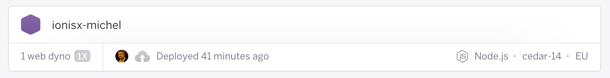
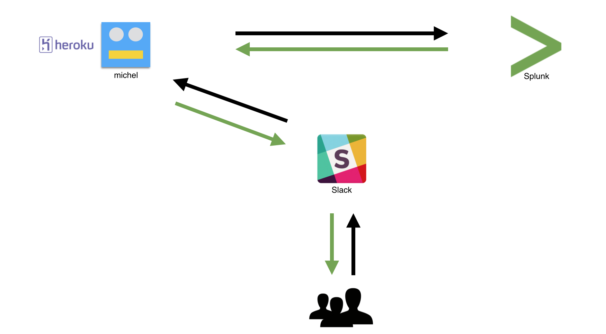

footer: Splunk User Group France (2015/04/28) – [@tusbar](https://twitter.com/tusbar) – CTO of [IONISx](https://ionisx.com)
slidenumbers: true

# When Splunk meets Slack


---

# Two issues

1. You don’t want all your users on Splunk
2. You don’t want your customers on Splunk


# One solution

→ Splunk SDK (for JavaScript)

---

# IONISx

**So, we’re using [Slack](https://slack.com).**

---

# Slack


Simple instant messaging for teams

IRC and XMPP gateways

Many third party app integrations

---

# IONISx

So, we’re using [Slack](https://slack.com).

**We built a [Hubot](https://github.com/github/hubot) with [slackhq/hubot-slack](https://github.com/slackhq/hubot-slack).**

(His name is *michel*)

---

# Hubot

*“A customizable, life embetterment robot”* by Github.

```js


// Drop this in a scripts directory and you’re done.

robot.hear(/what is the answer?/i, function (msg) {
    msg.reply('42');
});
```

---

# IONISx

So, we’re using [Slack](https://slack.com).

We built a [Hubot](https://github.com/github/hubot) with [slackhq/hubot-slack](https://github.com/slackhq/hubot-slack).

**We made him query Splunk using [the SDK](https://github.com/splunk/splunk-sdk-javascript).**

---

# Splunk SDK for JavaScript

Provides a simple query API

```js


splunk.oneshotSearch(
    'search sourcetype=access_combined | stats count by status', {
        earliest_time: moment().startOf('day').toISOString()
    }, function (err, data) {
        // …
    }
);
```

---

# IONISx

So, we’re using [Slack](https://slack.com).

We built a [Hubot](https://github.com/github/hubot) with [slackhq/hubot-slack](https://github.com/slackhq/hubot-slack).

We made him query Splunk using [the SDK](https://github.com/splunk/splunk-sdk-javascript).

**Then we hosted him on [Heroku](https://heroku.com).**

---

# Heroku

A PaaS.



---



---

# Configuration

```js
var splunk = new sdk.Service({
    autologin: true,
    scheme: process.env.SPLUNK_MGMT_SCHEME,
    host: process.env.SPLUNK_MGMT_HOST,
    port: process.env.SPLUNK_MGMT_PORT,
    app: process.env.SPLUNK_MGM_APP,
    username: process.env.SPLUNK_MGMT_USERNAME,
    password: process.env.SPLUNK_MGMT_PASSWORD,
    version: process.env.SPLUNK_MGMT_VERSION
});
```

---

# Example

```js
robot.respond(/how many users were online today?/i, function (msg) {

    splunk.oneshotSearch(
        'search sourcetype=tracking username!="" | stats count by username | stats count', {
            earliest_time: moment().startOf('day').toISOString()
        }, function (err, data) {

            if (data && data.rows && data.rows.length) {
                msg.reply(util.format(
                    'there were %s users online today',
                    data.rows[0]
                ));
            }
        }
    );
})
```

---

# Questions?


